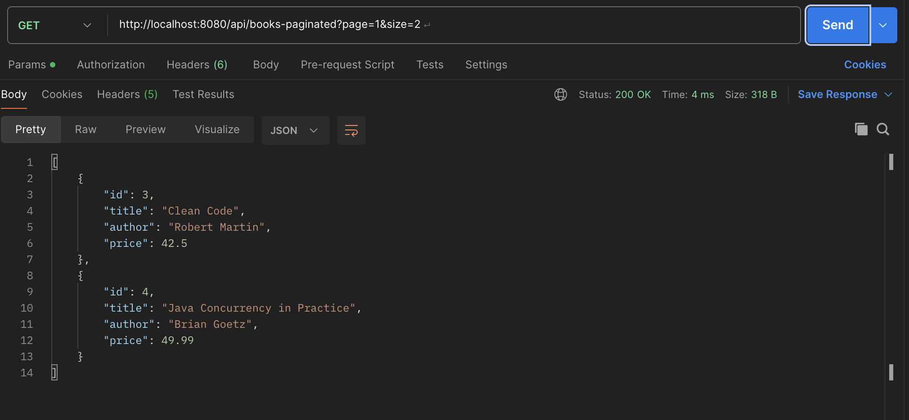
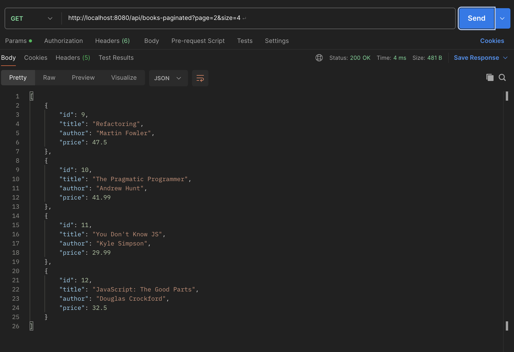
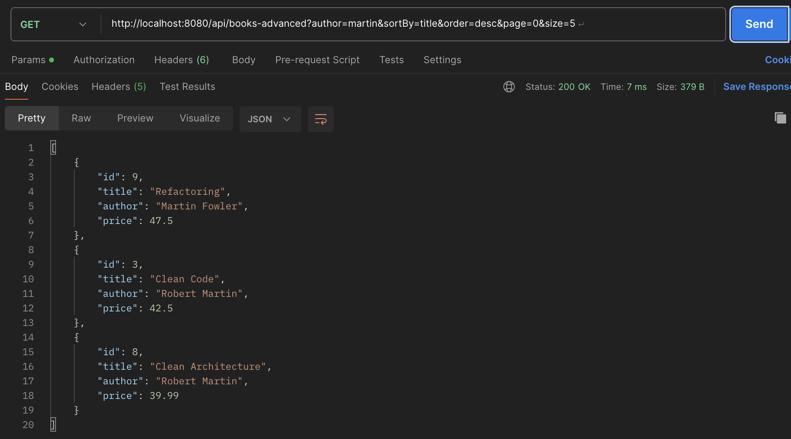
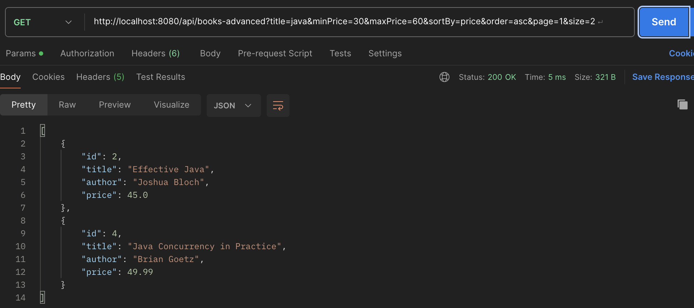
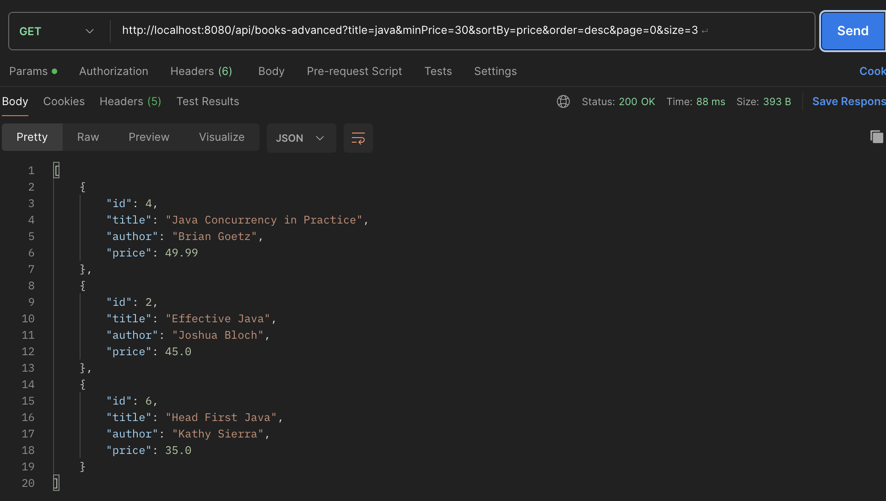

# Assignment 1 
CPSC449 
Mariia Nikitash
## 1. PUT endpoint (update book)

First, I tested retrieving the first book:
**GET** `/api/books/1`

Then, I updated the title in the existing book:

**PUT** `/api/books/1`

<b>Result</b>: The `"title"` field was updated successfully. Since **PUT** performs a full update, the `"author"` and `"price"` fields were replaced with `null` because they were not included in the request body.  
<b>Console Output</b>:

Attempting to update a non-existing resource:

**PUT** `/api/books/100`

<b>Result</b>: A `ResponseStatusException` was thrown, returning `HTTP 404` to indicate that the requested resource was not found.
 <b>Console Output</b>:

---
## 2. PATCH endpoint (partial update)
First, I retrieved an existing book to confirm the current values:

**GET** `/api/books/2`

Then, I partially updated the book:

**PATCH** `/api/books/partial-update/2`

<b>Result</b>: The `"title"`and `"price"` fields were updated successfully. Since **PATCH** performs a partial update, the `"author"` field stayed the same because it was not included in the request body.  

---
## 3. DELETE endpoint (remove book)

First, I retrieved Book with ID 3 to confirm it exists:

**GET** `/api/books/3`

Then, I deleted the book:

**DELETE** `/api/books/3`

<b>Result</b>:  
The request returned `200 OK` and responded with the deleted book object.  
The console log confirmed:

---

Finally, I attempted to delete the same book again:

**DELETE** `/api/books/3`

<b>Result</b>:  
The request returned **404 Not Found**, confirming that the book no longer exists in the system.
---

## 4. GET endpoint with pagination
This endpoint supports pagination using query parameters:

GET `/api/books-paginated?page={page}&size={size}`

- `page` → page number (starting from 0)
- `size` → number of books per page
- Maximum page size is limited to 100 to prevent abuse

### Example 1

GET `/api/books-paginated?page=1&size=2`

**Result:**  
The API returned the second page (page index starts at 0) with 2 books.

### Example 2

GET `/api/books-paginated?page=2&size=4`

**Result:**  
The API skipped the first 8 books (page × size) and returned the next 4 books.

### Behavior

- Pagination is implemented using Java Streams:
    - `.skip(offset)` to move to the correct page
    - `.limit(size)` to restrict results
- If a page exceeds the available data, the API returns `200 OK` with an empty list.
---
## 5. Advanced GET endpoint with filtering, sorting, and pagination combined in the valid order

GET `/api/books-advanced`

This endpoint supports:

- Filtering (`title`, `author`, `minPrice`, `maxPrice`)
- Sorting (`sortBy=title|author|price`)
- Order (`asc` or `desc`)
- Pagination (`page`, `size`)

### Example 1
Filter by Author + Sort by Title (DESC)

GET `/api/books-advanced?author=martin&sortBy=title&order=desc&page=0&size=5`

**Result:**
- Filters books where author contains "martin"
- Sorts by title in descending order
- Returns first 5 results

### Example 2
Filter by Title + Price Range + Sort by Price (ASC) + Pagination

GET `/api/books-advanced?title=java&minPrice=30&maxPrice=60&sortBy=price&order=asc&page=1&size=2`

**Result:**

- Filters books with "java" in title
- Only books priced between 30–60
- Sorts by price ascending
- Skips first page and returns 2 results

### Example 3
Filter by Title + Sort by Price (DESC)

GET `/api/books-advanced?title=java&minPrice=30&sortBy=price&order=desc&page=0&size=3`

**Result:**
- Filters books with "java" in title
- Minimum price of 30
- Sorts by price descending
- Returns first 3 results

