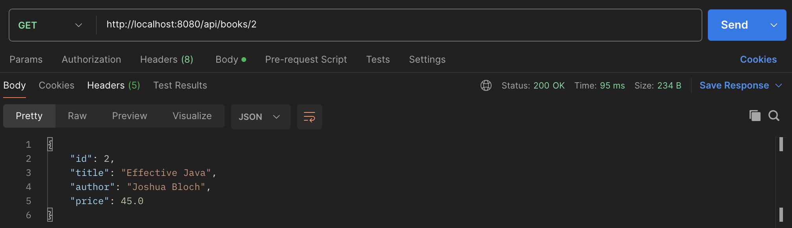
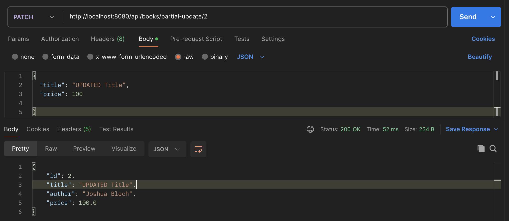
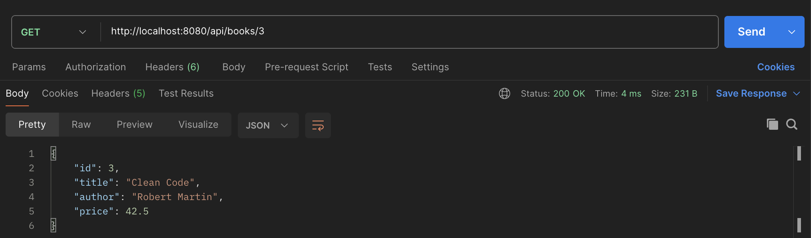
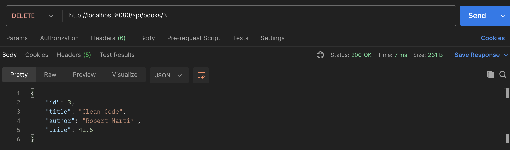
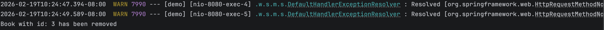
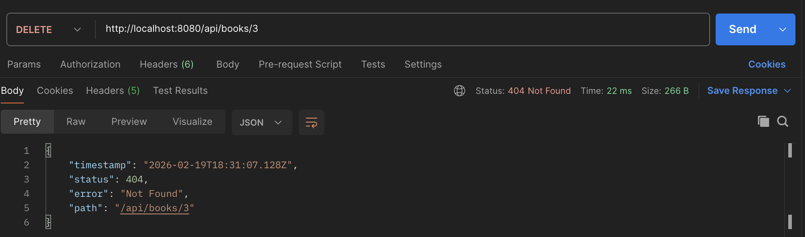

# Assignment 1 

## 1. PUT endpoint (update book)

First, I tested retrieving the first book:
**GET** `/api/books/1`

---

Then, I updated the title in the existing book:

**PUT** `/api/books/1`

<b>Result</b>: The `"title"` field was updated successfully. Since **PUT** performs a full update, the `"author"` and `"price"` fields were replaced with `null` because they were not included in the request body.  
<b>Console Output</b>:

Attempting to update a non-existing resource:

**PU** `/api/books/100`

<b>Result</b>: A `ResponseStatusException` was thrown, returning `HTTP 404` to indicate that the requested resource was not found.
 <b>Console Output</b>:

## 2. PATCH endpoint (partial update)
First, I retrieved an existing book to confirm the current values:

**GET** `/api/books/2`

Then, I partially updated the book:

**PATCH** `/api/books/partial-update/2`

<b>Result</b>: The `"title"`and `"price"` fields were updated successfully. Since **PATCH** performs a partial update, the `"author"` field stayed the same because it was not included in the request body.  

## 3. DELETE endpoint (remove book)

First, I retrieved Book with ID 3 to confirm it exists:

**GET** `/api/books/3`

Then, I deleted the book:

**DELETE** `/api/books/3`

<b>Result</b>:  
The request returned `200 OK` and responded with the deleted book object.  
The console log confirmed:

---

Finally, I attempted to delete the same book again:

**DELETE** `/api/books/3`

<b>Result</b>:  
The request returned **404 Not Found**, confirming that the book no longer exists in the system.

## 4. GET endpoint with pagination

## 5. Advanced GET endpoint with filtering, sorting, and pagination combined in the valid order

