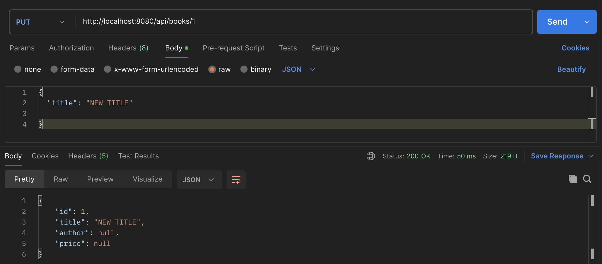
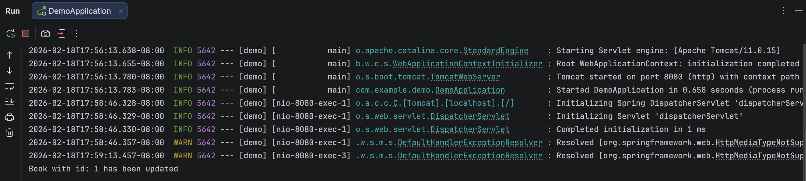
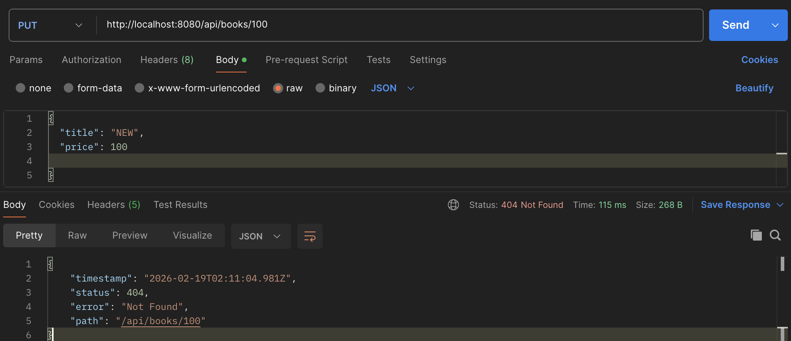
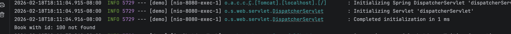

# Assignment 1 

## 1. PUT endpoint (update book)

First, I tested retrieving the first book:
`GET /api/books/1`

---

Then, I updated the title in the existing book:

`PUT /api/books/1`

<b>Result</b>: The `"title"` field was updated successfully. Since `PUT` performs a full update, the `"author"` and `"price"` fields were replaced with `null` because they were not included in the request body.  
<b>Console Output</b>:

Attempting to update a non-existing resource:

`PUT /api/books/100`

<b>Result</b>: A `ResponseStatusException` was thrown, returning `HTTP 404` to indicate that the requested resource was not found.
 <b>Console Output</b>:

## 2. PATCH endpoint (partial update)

## 3. DELETE endpoint (remove book)

## 4. GET endpoint with pagination

## 5. Advanced GET endpoint with filtering, sorting, and pagination combined in the valid order

